<p align="center">
  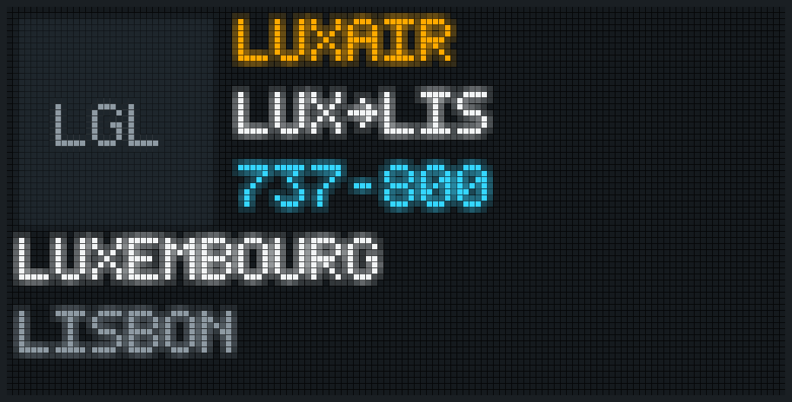
</p>

<h1 align="center">THE WALL</h1>

<p align="center">
  Ein LED-Panel mit 128 × 64 Pixeln fürs Regal, das die Flugzeuge über deinem Zuhause zeigt.<br>
  Dazu Uhr, Wetter und Notizen. Ein kleiner Server holt die Daten, eine Webseite steuert es.
</p>

<p align="center">
  <a href="LICENSE"></a>
  <a href="docs/LICENSE.md"></a>
  
  
  <a href="#mit-ki-gebaut"></a>
</p>

<p align="center"><a href="README.md">English</a> · <b>Deutsch</b></p>

---

THE WALL ist ein LED-Panel fürs Wohnzimmer. Es misst 32 mal 16 Zentimeter und hat 8 192 Pixel. Fliegt ein Flugzeug vorbei, zeigt es die Airline, die Strecke, den Flugzeugtyp und wie hoch und schnell es fliegt. Gebaut wurde es in Luxemburg für zwei Geräte, es funktioniert aber überall, wo [adsb.lol](https://adsb.lol) Flugzeuge empfängt.

Das Gerät selbst bleibt einfach. Alle zehn Sekunden fragt es den Server, was es zeichnen soll, und bekommt eine kurze Liste von Zeichenbefehlen zurück. Neue Anzeigemodi entstehen auf dem Server und brauchen keine neue Firmware, und kein Zugang zu einem fremden Dienst landet je auf dem Gerät.

## Stand

| Teil | Stand |
| --- | --- |
| Server und Webseite | laufen seit September 2026 unter [thewall.godart.lu](https://thewall.godart.lu), Code in [`web/`](web) |
| Geräteschnittstelle | beschrieben und getestet in [`docs/server/geraet.md`](docs/server/geraet.md), die Firmware wird dagegen gebaut |
| Firmware | läuft seit dem 14. September 2026 auf dem Board: Start- und Zustandsanimationen, Einrichtungsnetz mit eigener Seite, Abruf beim Server, der Uhrchip des Boards. Seit Version 0.1.2 kam jedes Update über das Netz. Beide Geräte laufen mit 0.2.2, die die Segment-Uhr in der Farbe der Uhr zeichnet. 0.2.1 vom 26. September 2026 brachte Ton für Timer und Wecker; gehört hat den Ton an einem Gerät noch niemand. Einzelheiten in [`firmware/`](firmware) |
| Standfuß | in OpenSCAD konstruiert und einmal gedruckt. Nach der ersten Anprobe ist der Schlitz 1 mm breiter, und die Lippe vorn deckt 1,5 mm statt 14 ab. Das Board sitzt quer auf vier Schnapp-Pins am rechten Fuß, ohne Schrauben |

Die Instanz unter thewall.godart.lu betreibt zwei Geräte und nimmt neue Konten nur mit Einladung auf. Wer eine eigene Wall baut, betreibt den Server selbst, dafür reichen ein PHP-Host und eine Datenbank.

## Was das Panel zeigt

| | |
| --- | --- |
| 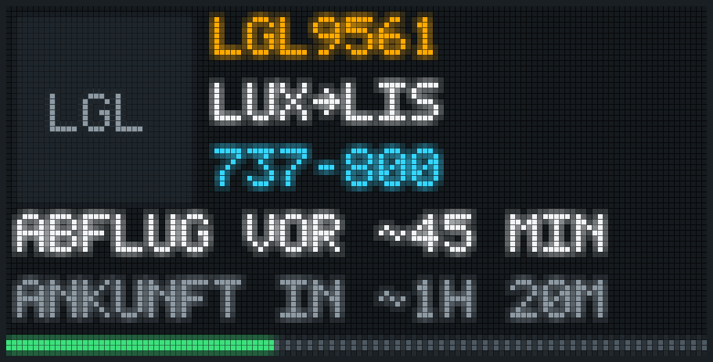 | 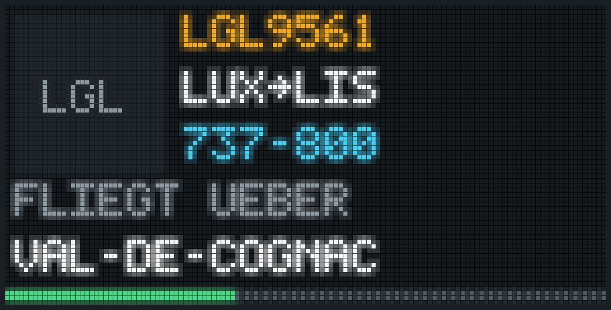 |
| **Flug, Abflug und Ankunft.** Beides Schätzungen aus Strecke und Tempo, deshalb mit Tilde. | **Flug, Position.** Der Ort unter dem Flugzeug, aus OpenStreetMap. |
| 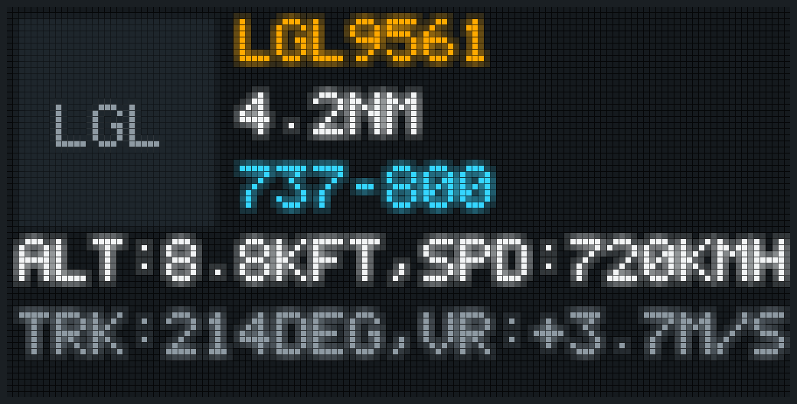 |  |
| **Flug, Messwerte.** Rufzeichen, Entfernung, Typ, Höhe in tausend Fuß, Tempo in km/h, Kurs und Steigrate. | **Flug, Route.** Airline, Strecke und der Flugzeugtyp ausgeschrieben, 737 MAX 8 statt B38M. |
| 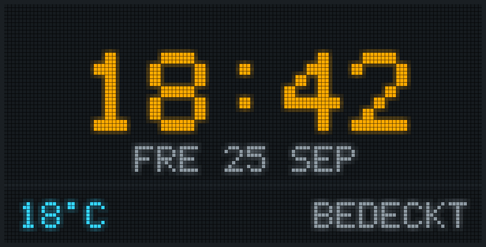 | 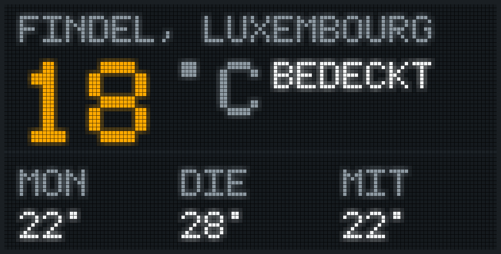 |
| **Uhr.** Drei Zifferblätter, 12 oder 24 Stunden, auf Wunsch mit Wetterzeile. | **Wetter.** Aktuell oder drei Tage im Voraus, von Open-Meteo. |

**Flugradar.** Das nächste Flugzeug im Umkreis von 5 bis 150 Seemeilen. Vier Ansichten wechseln alle 2 bis 30 Sekunden: Route, Abflug und Ankunft, Position, Messwerte. Nach jeder Standzeit (3 bis 60 Sekunden) schaut der Server neu und wechselt, wenn ein anderes Flugzeug näher ist. Höhe, Tempo, Steigrate und Abstand stehen in der Einheit der Wahl (Fuß oder Meter, km/h, Knoten oder mph, m/s oder ft/min, Seemeilen, Kilometer oder Meilen). Überflieger über 30 000 Fuß lassen sich ausblenden, Militärflugzeuge bekommen eine eigene Farbe, und ein einzelner Flug lässt sich über Flugnummer, Rufzeichen oder Kennzeichen anheften, egal wo auf der Welt: das Panel folgt dann nur diesem Flug, worüber er fliegt, wann er gestartet ist und wann er landet. Ist der Himmel leer, zeigt das Panel die Uhr, eine Warte-Animation oder einen ruhigen Ruhezustand.

**Uhr und Wetter.** Die Uhrzeit rechnet das Gerät aus seiner eigenen Uhr, der Server schickt nur die Zeitzone. Das Wetter wird alle 15 Minuten erneuert, in Celsius oder Fahrenheit, auf Wunsch mit Wind.

**Notizen.** Zwei Zeilen mit je 21 Zeichen, von der Webseite geschickt. Eine neue Notiz blinkt dreimal und steht zehn Minuten vorn. Gäste mit Leserecht dürfen ebenfalls Notizen schicken, sonst nichts.

<p align="center">
  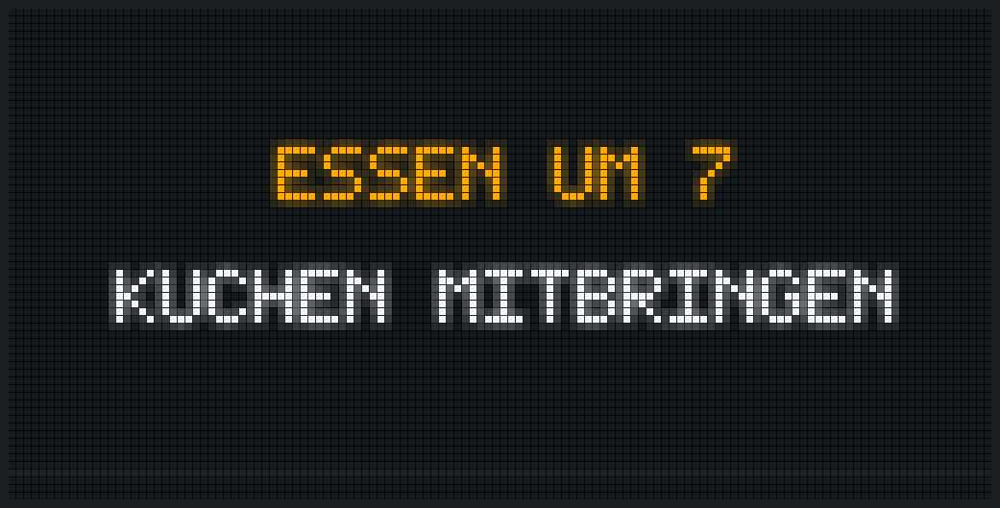
</p>

**Nahverkehr.** Bis zu drei Haltestellen aus der OpenAPI der Administration des transports publics (mobiliteit.lu): Busse, Züge und Trams auf einer Tafel. Standardmäßig Minuten, auf Wunsch die Uhrzeit, die Verspätung steckt in der Farbe, Zeichen für Ausfall, Teilausfall, Zusatzfahrt und Ersatzverkehr, und Meldungen laufen unten durch. Mehrere Haltestellen auf einer Tafel wechseln sich ab, damit ein Bahnhof auch seinen Zug zeigt und nicht nur vier Busse. Gewählt werden die Haltestellen auf einer Karte mit allen Haltestellen des Landes, mit Suche nach Ort oder Haltestelle. Kommt der Modus in der Rotation dran, fallen die Zeilen nacheinander ein. Braucht einen persönlichen Schlüssel der ATP, verschlüsselt im Admin-Bereich gespeichert.

<p align="center">
  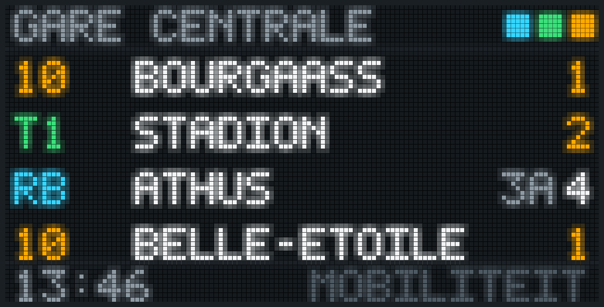
</p>

**Spotify.** Was im eigenen Spotify-Konto läuft: Cover, Titel, Künstler und Album, darunter eine Zeitleiste, die das Gerät selbst weiterzählt. Vier Layouts: klassisch, großes Cover, Farben aus dem Cover und eine Platte, die sich hinter der Hülle dreht. Zehn Sekunden vor dem Ende steht der nächste Titel eine Zeile tiefer da, dann rollt ihn eine Walze herein; wer am Handy weiterspringt, sieht stattdessen ein Karussell. Album, Als Nächstes und Nur Cover können im Wechsel dazukommen. Jedes Konto verbindet sein eigenes Spotify auf der Geräteseite, gesteuert wird nichts. Braucht Firmware 0.2.0 und eine App im Spotify-Dashboard, deren Zugang in den Admin-Bereich gehört.

**Timer und Wecker.** Timer startet man auf der Webseite oder aus Home Assistant, bis zu fünf gleichzeitig. Solange einer läuft, zeigt jeder Modus die Restzeit in einer Ecke, in den meisten oben rechts; der Flugmodus kürzt Zeile 1 dann auf neun Zeichen und zeigt den ganzen Namen wieder, sobald der Timer weg ist. Ist er abgelaufen, sagt es das ganze Panel, bis jemand stoppt, höchstens 15 Minuten. Ein Wecker je Gerät mit Uhrzeit und Wochentagen, in der Zeitzone des Geräts. Ab Firmware 0.2.1 piept das Gerät über den Lautsprecher, klingelt den Wecker auch ohne Internet und stoppt auf einen Druck aufs Rad.

**Rotation.** Flug, Uhr, Wetter, Nahverkehr und Spotify im Wechsel, jeder Modus 10 Sekunden bis 10 Minuten lang, ohne eigene Einstellung 30 Sekunden; Spotify nur, solange Musik läuft. Die Helligkeit wird auf der Webseite eingestellt und kann zwischen Sonnenuntergang und Sonnenaufgang auf 35 Prozent dieses Werts sinken. Ein Schalter auf der Geräteseite reduziert die Bewegung auf dem Panel: kein Schieben, kein Blinken, Schrift steht still.

Die Panel-Bilder in dieser README rechnet [`tools/panel-png.mjs`](tools/panel-png.mjs) aus denselben Zeichenbefehlen, die das Gerät bekommt. Die Flugbilder zeigen den Demoflug der Startseite, der Ort darunter ist eine echte Antwort von OpenStreetMap. Airline-Logos gehören nicht zu diesem Repo, deshalb zeigen die Bilder stattdessen einen farbigen Block mit dem ICAO-Kürzel.

## Die Webseite

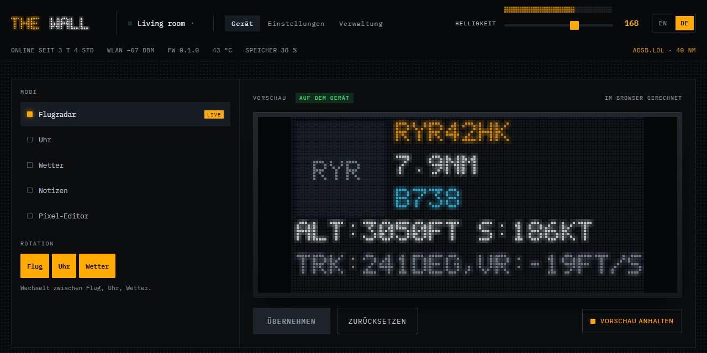

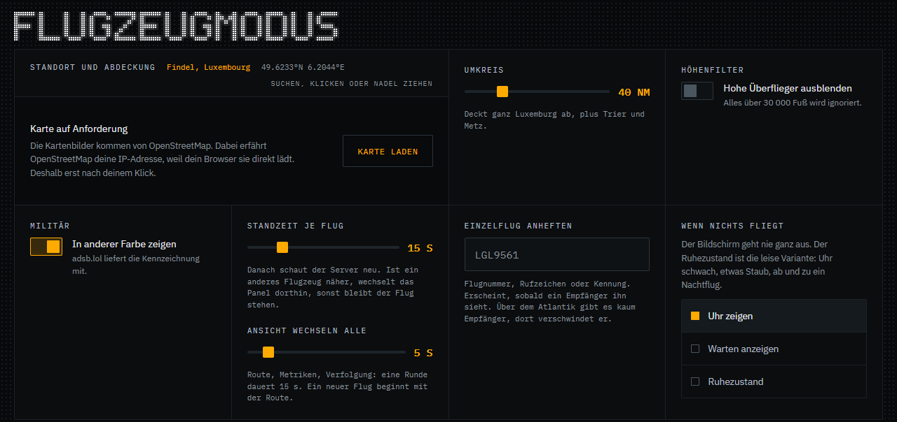

- Neben jeder Einstellung eine Live-Vorschau des Panels, gebaut aus derselben Antwort, die das Gerät bekäme. Beim Gerät kommt eine Änderung erst nach **Übernehmen** an.
- Die Karte auf der Geräteseite zeigt die Flugzeuge im Umkreis live, alle zehn Sekunden, aus demselben Zwischenspeicher des Servers wie das Panel. Ein Schalter hält sie an.
- Konten mit E-Mail, Benutzername und Passwort. Registrieren geht nur mit Einladung, bis der Admin es öffnet.
- Geräte lassen sich per E-Mail teilen: mit Bearbeitungsrecht oder mit Leserecht für Gäste.
- Ein API-Schlüssel pro Konto für alle Geräte. Er lässt sich neu erzeugen, die Webseite warnt vorher.
- Datenexport als Download oder per Mail. Ein Konto lässt sich auf seiner Einstellungsseite löschen.
- Admin-Bereich mit Abfragebudgets je Datendienst, allen Geräten, einem gestuften Firmware-Rollout, SMTP mit Test-Mail, dem Impressum und Testgeräten für Konten ohne Hardware.
- Eine Integration für Home Assistant in [`homeassistant/`](homeassistant), für HACS unter [LennyGodart/THE-WALL-HA](https://github.com/LennyGodart/THE-WALL-HA): das Panel als Licht, der Modus als Auswahl, Notizen als Benachrichtigung, Timer, der Wecker und der Flug auf dem Panel als Sensoren. Home Assistant findet das Gerät im Heimnetz (Firmware 0.2.1), gekoppelt wird mit einem Code aus sechs Zeichen, der auf dem Panel erscheint. Jede Kopplung gilt für ein Gerät und bekommt einen eigenen Schlüssel.
- Englisch und Deutsch, auf jeder Seite umschaltbar.
- Keine Tracker, keine Analytics, keine fremden Skripte. Das einzige Cookie ist die Sitzung, deshalb gibt es kein Cookie-Banner. Die Karte auf der Geräteseite lädt erst nach einem Klick von OpenStreetMap.

## So funktioniert es

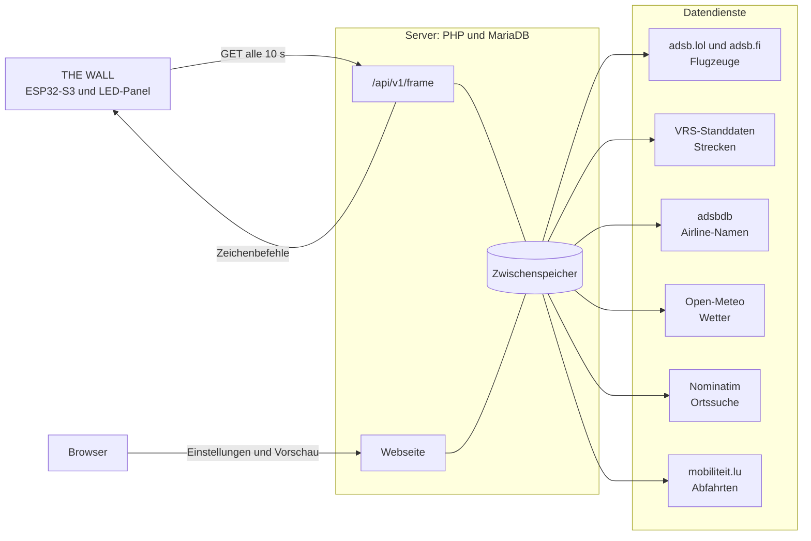

Das Gerät fragt immer, der Server schiebt nie. Das kommt durch jeden Heimrouter, ohne Port-Forwarding. Zwischen den vollen Abrufen alle zehn Sekunden fragt es alle zwei Sekunden nach einer Revisionsnummer, so ist eine Änderung auf der Webseite in gut zwei Sekunden auf dem Panel. Jede Antwort deckt die nächsten 25 Sekunden ab, als Seiten mit festen Zeitfenstern, deshalb passen zwei Antworten ohne Sprung aneinander. Eine Seite ist eine Liste von Befehlen, und die Firmware kennt vierzehn davon: `text`, `ticker`, `rect`, `bar`, `frame`, `logo`, `clock`, `date`, `anim`, seit 0.1.9 `bmp` und `dot` für die Karte, seit 0.2.0 `prog`, `count` und `disc` für Spotify.

Eine Strecke zählt nur, wenn sie zum Flugzeug passt. Beide Streckenquellen kennen je Rufzeichen eine Strecke, aber keinen Tag: dasselbe Rufzeichen fliegt nachmittags den Rückflug, in den USA oft an einem anderen Tag eine andere Strecke. Deshalb prüft der Server Position, Höhe, Steigen und Kurs gegen jede Teilstrecke, bevor er Abflug, Ziel oder Ankunftszeit zeigt. Gemessen am 24. September 2026 über neun Flughäfen in den USA und Europa passten 268 von 286 Strecken aus den VRS-Standdaten, und jede verworfene war ein anderer Flug.

```json
{"from": 1789289999000, "to": 1789290008000, "id": "flight", "ops": [
  {"t": "logo", "code": "LGL", "x": 2, "y": 2},
  {"t": "text", "x": 38, "y": 2, "s": "LUXAIR", "c": "FFAA00"},
  {"t": "bar", "x": 0, "y": 61, "w": 79, "c": "3DE07C"}
]}
```

Der Server kürzt jede Zeile auf 21 Zeichen und schreibt Umlaute um, bevor er sendet. Ein neuer Modus ist eine PHP-Datei in `web/.htapp/modes/` und kostet die Firmware nichts. Der Flash ist nicht der Grund für diesen Aufbau, das Board hat 16 MB. Die Gründe sind Modi ohne Neuflashen, eine zwischengespeicherte Abfrage je Standort statt einer je Gerät, und keine Zugangsdaten in einer Firmware, die jeder auslesen kann.

## Hardware

| Teil | Bezug | Preis (Sept. 2026) |
| --- | --- | --- |
| Ocnvlia P2.5 LED-Panel, 128 × 64 Pixel, 320 × 160 mm, HUB75E | [Amazon B0H1MPC9YZ](https://www.amazon.de/dp/B0H1MPC9YZ) | 43,63 € |
| SEENGREAT RGB Matrix HUB75 S3 V1.0 mit ESP32-S3-WROOM-1-N16R8 (16 MB Flash, 8 MB PSRAM), microSD, RTC, Audio | [Amazon B0H69TFHJ7](https://www.amazon.de/dp/B0H69TFHJ7) | 35,88 € |
| Standfuß, zwei Druckteile aus [`hardware/standfuss/`](hardware/standfuss) | eigener Drucker | etwa 1 € Filament |
| USB-C-Ladegerät, 5 V und 3 A | | |

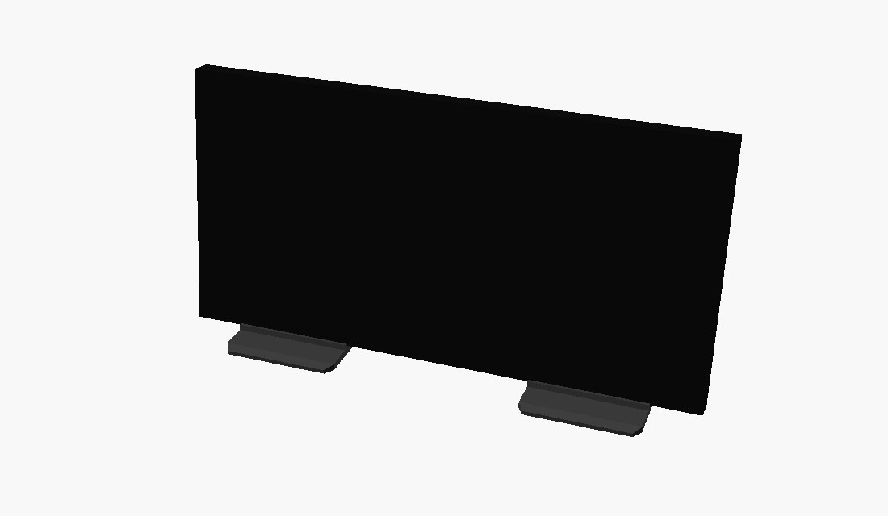

Strom kommt über die Buchse USB-C ans Board, das Board gibt die 5 V über das beiliegende Kabel ans Panel weiter. Die zweite Buchse POWER bleibt frei. Das Panel hat den Treiber-Chip FM6126A und bleibt dunkel, solange die Firmware nicht `mxconfig.driver = HUB75_I2S_CFG::FM6126A;` setzt, auch wenn jeder Pin stimmt. Pinbelegung, Hinweise zum Treiber und die Maße für den Standfuß stehen in [`hardware/README.md`](hardware/README.md).

## Eigenen Server betreiben

Nötig sind ein Webserver mit PHP 8.5 (pdo_mysql, curl, sodium, mbstring, openssl, für Akzente, Albumcover und die genaue Karte auch intl, gd und zlib), MariaDB und ein SMTP-Zugang für Mails. Kein Framework, kein Composer, kein Build, kein Cronjob.

1. `web/` ins Webroot kopieren. Alles, was keine Datei ist, geht an `index.php`, und alles unter `/.ht` muss gesperrt sein:
   ```nginx
   location / { try_files $uri $uri/ /index.php?$args; }
   location ~ /\.(ht|svn|git) { deny all; }
   ```
   Apache nimmt die mitgelieferten `.htaccess`-Dateien.
2. `.htdata/config.php` nach [`web/.htapp/config.example.php`](web/.htapp/config.example.php) anlegen, mit der Adresse der Seite und dem Datenbankzugang.
3. `https://<deine-domain>/account` einmal aufrufen. Solange es kein Konto gibt, legt das `.htdata/secret.php` an und richtet die Datenbank ein.
4. `setup_token` aus `.htdata/secret.php` nehmen und `https://<deine-domain>/account?mode=register&setup=<token>` öffnen. Das erste Konto wird Admin.
5. Im Admin-Bereich SMTP eintragen und eine Test-Mail schicken, danach das Impressum ausfüllen. Die Kontakt-E-Mail landet auch im User-Agent, den adsb.lol und adsbdb verlangen.

Zum Ausprobieren mit SQLite: `bash tools/dev-server.sh` starten und http://127.0.0.1:8765 öffnen. Hosting, Sicherung und Mailversand im Detail: [`docs/server/betrieb.md`](docs/server/betrieb.md).

### Airline-Logos

Logos sind eingetragene Marken der Airlines und liegen nicht in diesem Repo. `node tools/logos-build.mjs` lädt die Sammlung [Jxck-S/airline-logos](https://github.com/Jxck-S/airline-logos), rechnet jedes Logo auf 32 × 34 LED-Pixel in Vollfarbe und schreibt je ICAO-Kürzel eine Datei für `.htdata/logos/` auf dem eigenen Server. Ohne Datei zeigt das Panel einen grauen Block mit dem Kürzel.

### Firmware-Updates

Die erste Firmware kommt per USB aufs Board, jede weitere über WLAN. Die App-Datei (`firmware.bin`) im Admin-Bereich hochladen oder als `.htdata/firmware/thewall-<x.y.z>.bin` auf den Server legen. Der Server liest die Version aus der Datei selbst, findet sie beim nächsten Abruf, rechnet ihre SHA-256 und bietet sie Geräten an, die in `X-Wall-Fw` eine niedrigere Version melden. Im Admin-Bereich wählst du, welcher Anteil der Geräte sie bekommt und ob sie sich selbst aktualisieren oder erst, wenn der Besitzer **Jetzt aktualisieren** drückt. Der ganze Ablauf, auch was das Gerät vor dem Neustart prüfen muss, steht in [`docs/server/betrieb.md`](docs/server/betrieb.md#firmware-ausrollen).

## Repo

| Pfad | Inhalt |
| --- | --- |
| [`web/`](web) | Server und Webseite, wird 1:1 ins Webroot kopiert |
| [`docs/server/`](docs/server) | Doku zu jeder Datei und Funktion, Geräteschnittstelle, Betrieb |
| [`docs/images/`](docs/images) | die Bilder dieser README |
| [`hardware/`](hardware) | Teile, Pins, Standfuß als OpenSCAD und STL |
| [`firmware/`](firmware) | Firmware für das Board mit ESP32-S3, gebaut mit PlatformIO |
| [`homeassistant/`](homeassistant) | die Integration für Home Assistant, MIT, auch als [THE-WALL-HA](https://github.com/LennyGodart/THE-WALL-HA) |
| [`tools/`](tools) | Node-Skripte ohne Abhängigkeiten: lokaler Server, Panel-Renderer, Logos, Prüfungen |
| [`CLAUDE.md`](CLAUDE.md) | Projektregeln für Gestaltung, Text, Barrierefreiheit und Architektur, liest Claude Code mit |
| [`CONTRIBUTING.de.md`](CONTRIBUTING.de.md) | Mitmachen: alles lokal starten, prüfen, Pull Request |

## Skripte

Node 18 oder neuer, keine Pakete. Aufruf aus dem Hauptverzeichnis.

| Aufruf | Zweck |
| --- | --- |
| `bash tools/dev-server.sh` | Webseite auf http://127.0.0.1:8765 mit SQLite |
| `node tools/panel-png.mjs antwort.json bild.png` | rechnet eine Antwort von `/api/v1/frame` als PNG, Referenz für die Firmware |
| `node tools/logos-build.mjs` | baut die Airline-Logos für den eigenen Server |
| `node --max-old-space-size=4096 tools/geo-welt.mjs` | rechnet die Weltkarte fürs Panel neu, aus Natural Earth und OurAirports |
| `node tools/fwdemo.mjs du@example.com` | holt die vier nächsten Flugzeuge um Luxemburg-Stadt von adsb.lol und adsbdb |
| `node tools/fontcmp.mjs web/assets/js/lib/pixelfont.js tools/font95.hex` | vergleicht den Pixelfont mit der Standardschrift der Panel-Bibliothek |
| `node tools/audit.mjs <ordner>` | prüft gespeicherte Seiten gegen die Regeln in `CLAUDE.md` |
| `node hardware/vol.mjs` | Filamentbedarf der STL-Dateien |

## Mit KI gebaut

THE WALL ist zusammen mit Claude entstanden, dem KI-Modell von Anthropic. Webseite, Mails und Panel-Animationen wurden in Claude Design gestaltet. Server, Webseiten-Code, Skripte und Doku sind mit Claude Code geschrieben, nach den Regeln in [`CLAUDE.md`](CLAUDE.md). Die Datei bleibt im Repo, damit jeder auf dieselbe Weise weiterbauen kann.

Lenny Godart hat entschieden, was gebaut wird und wie es sich verhalten soll, und die Ergebnisse auf der laufenden Seite geprüft. Noch bevor es Hardware gab, wurde die Geräteschnittstelle live mit einem Client getestet, der dieselben Anfragen schickt wie später die Firmware. Die Firmware ist auf dieselbe Art entstanden und läuft seit dem 14. September 2026 auf dem Board.

## Quellen und Dank

- Flugzeugpositionen: [adsb.lol](https://adsb.lol), offene Daten unter der ODbL, und [adsb.fi](https://adsb.fi)
- Strecken: [Standdaten von Virtual Radar Server](https://github.com/vradarserver/standing-data), gemeinfrei (CC0), stündlich gespiegelt von adsb.lol
- Airline-Namen und Ersatz-Strecken: [adsbdb](https://www.adsbdb.com)
- Wetter: [Open-Meteo](https://open-meteo.com), CC BY 4.0
- Nahverkehr: Administration des transports publics, [mobiliteit.lu](https://www.mobiliteit.lu), CC BY 4.0
- Musik: Titel, Cover und Warteschlange von [Spotify](https://www.spotify.com), gelesen über die Spotify Web API
- Karten, Ortssuche und der Ort unter einem Flugzeug: Mitwirkende von [OpenStreetMap](https://www.openstreetmap.org/copyright), ODbL, mit Nominatim
- Küsten, Grenzen, Seen, Flüsse, Stadtgebiete und Ortsnamen auf der Panel-Karte: [Natural Earth](https://www.naturalearthdata.com), gemeinfrei
- Flugplätze und Bahnen auf der Panel-Karte: [OurAirports](https://ourairports.com/data/), gemeinfrei
- Kartenbibliothek: [Leaflet](https://leafletjs.com), BSD 2-Clause, liegt in `web/assets/vendor/leaflet/`
- Schriften: IBM Plex Mono und IBM Plex Sans, SIL Open Font License, über [Bunny Fonts](https://fonts.bunny.net)
- Quelle der Airline-Logos: [Jxck-S/airline-logos](https://github.com/Jxck-S/airline-logos), nicht enthalten
- `tools/font95.hex`: die Zeichen 32 bis 126 aus `glcdfont.c` von Adafruit GFX, BSD-Lizenz
- Die Idee einer Fluganzeige fürs Regal stammt von der FlightWall

Flug-, Wetter- und Nahverkehrsdaten kommen von Dritten und können falsch, verspätet oder unvollständig sein. Sie taugen nicht zur Navigation und für keine Entscheidung im Luftverkehr.

## Lizenz

Code (`web/`, `tools/`, `firmware/`) steht unter der [MIT-Lizenz mit Commons Clause](LICENSE): nutzen, ändern, eine eigene Wand bauen und Änderungen teilen, aber nicht verkaufen, weder als Produkt noch als fertiges Gerät noch als bezahlten Dienst. Die Home-Assistant-Integration in [`homeassistant/`](homeassistant) steht unter der reinen MIT-Lizenz. Doku (`docs/`, beide README-Dateien) und Hardware (`hardware/`) stehen unter [CC BY-NC-SA 4.0](docs/LICENSE.md). Fremde Teile behalten ihre eigenen Lizenzen, siehe oben.

Streng genommen ist THE WALL damit kein Open Source, sondern offener Quelltext: Lesen, Nachbauen und Ändern ist erlaubt, nur Verkaufen nicht. Beiträge sind willkommen, siehe [CONTRIBUTING.de.md](CONTRIBUTING.de.md).
