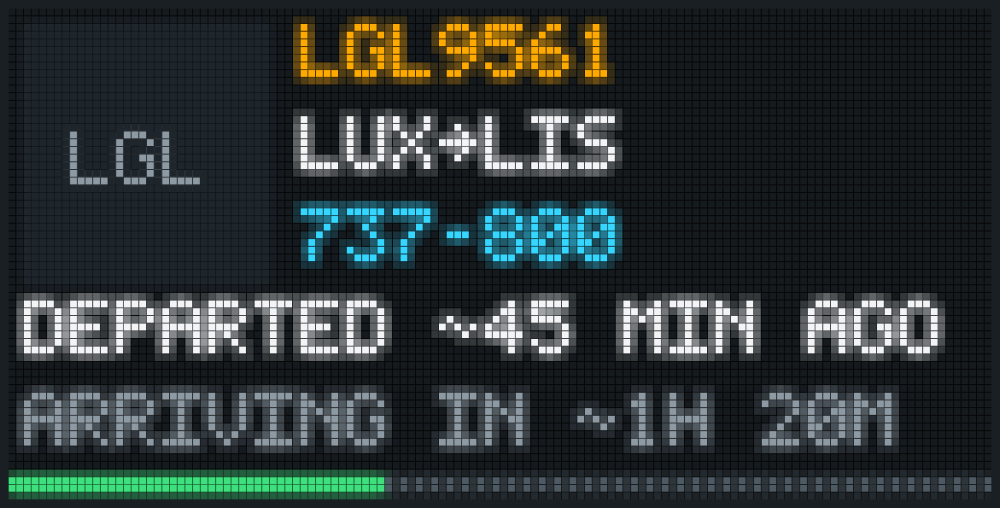
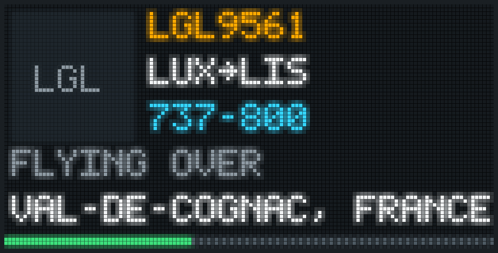
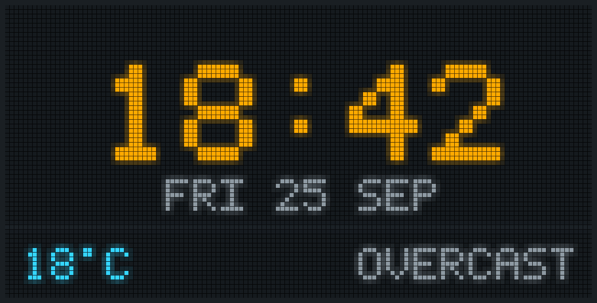
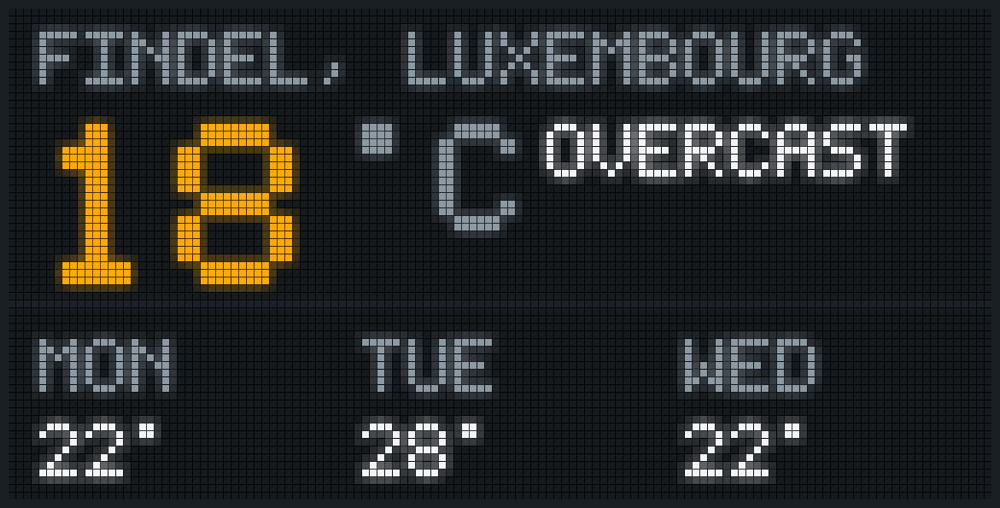
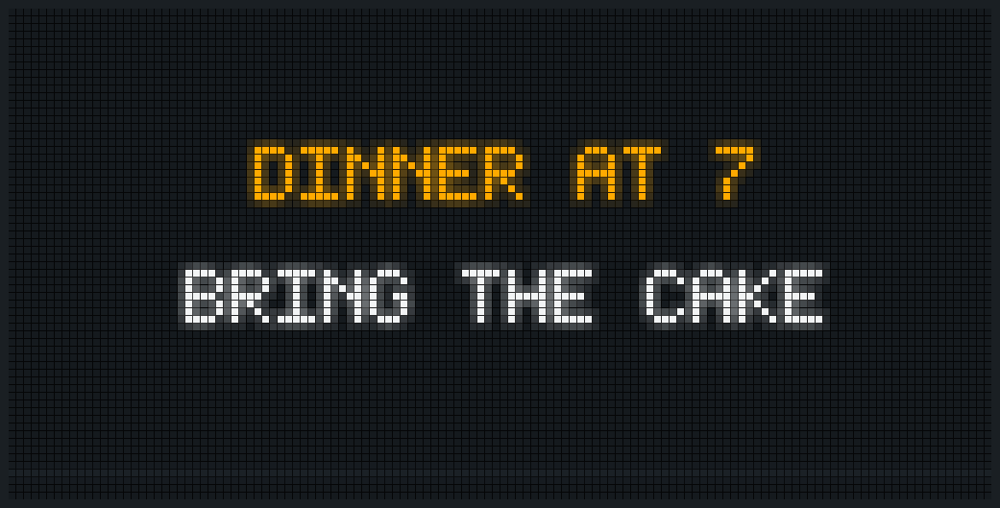
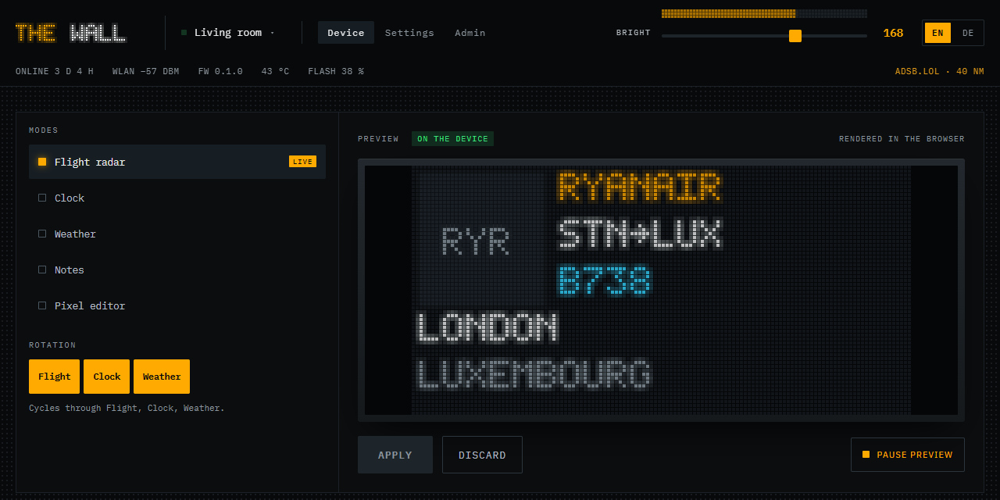
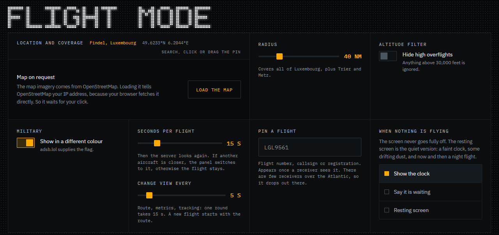
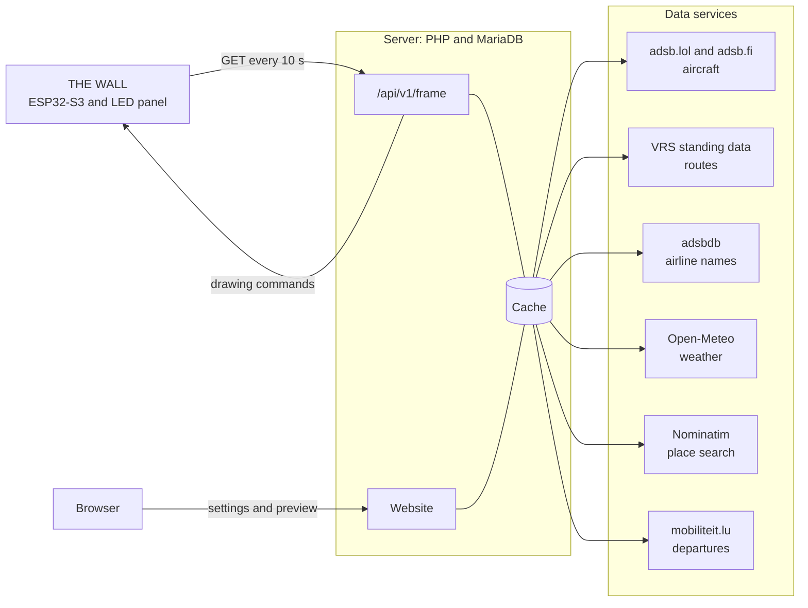

<p align="center">
  
</p>

<h1 align="center">THE WALL</h1>

<p align="center">
  A 128 × 64 LED panel on your shelf that shows the aircraft flying over your home.<br>
  Plus the time, the weather and your notes. A small server fetches the data, a website runs it.
</p>

<p align="center">
  <a href="LICENSE"></a>
  <a href="docs/LICENSE.md"></a>
  
  
  <a href="#built-with-ai"></a>
</p>

<p align="center"><b>English</b> · <a href="README.de.md">Deutsch</a></p>

---

THE WALL is an LED panel for the living room. It measures 32 by 16 centimetres and has 8,192 pixels. When a plane passes over, it shows the airline, the route, the aircraft type, and how high and fast it flies. It was built in Luxembourg for two devices and works anywhere [adsb.lol](https://adsb.lol) receives aircraft.

The device itself stays simple. Every ten seconds it asks the server what to draw and gets back a short list of drawing commands. New display modes are written on the server and need no new firmware, and no credential for an outside service ever ends up on the device.

## Status

| Part | State |
| --- | --- |
| Server and website | Running since September 2026 at [thewall.godart.lu](https://thewall.godart.lu), code in [`web/`](web) |
| Device interface | Documented and tested in [`docs/server/geraet.md`](docs/server/geraet.md), the firmware is built against it |
| Firmware | Runs on the board since 14 September 2026: boot and status animations, setup network with its own page, polling the server, the onboard clock chip. Since version 0.1.2 every update has arrived over the air. Both devices run 0.2.1 since 26 September 2026, which adds sound for timers and the alarm; the sound has not been heard on a device yet. Details in [`firmware/`](firmware) |
| Stand | Designed in OpenSCAD and printed once. After the first fit the slot is 1 mm wider and the front lip covers 1.5 mm instead of 14. The board sits landscape on four printed snap-fit pins on the right foot, no screws |

The instance at thewall.godart.lu runs two devices and takes new accounts by invitation only. To build your own wall, host the server yourself, it takes one PHP host and a database.

## What the panel shows

| | |
| --- | --- |
|  |  |
| **Flight, departure and arrival.** Both are estimates from distance and speed, marked with a tilde because they are. | **Flight, position.** The place under the aircraft, from OpenStreetMap. |
|  |  |
| **Flight, metrics.** Callsign, distance, type, altitude in thousands of feet, speed in km/h, track and vertical rate. | **Flight, route.** Airline, route and the aircraft type written out, 737 MAX 8 rather than B38M. |
|  |  |
| **Clock.** Three faces, 12 or 24 hours, with an optional weather line. | **Weather.** Current conditions or three days ahead, from Open-Meteo. |

**Flight radar.** The nearest aircraft within 5 to 150 nautical miles. Four views take turns every 2 to 30 seconds: route, departure and arrival, position, metrics. After each dwell time (3 to 60 seconds) the server looks again and switches when another aircraft is closer. Altitude, speed, climb and distance come in the units you pick (feet or metres, km/h, knots or mph, m/s or ft/min, nautical miles, km or miles). Overflights above 30,000 feet can be hidden, military aircraft get their own colour, and a single flight can be pinned by flight number, callsign or registration, anywhere in the world: the panel then follows that one flight, what it is flying over, when it left and when it lands. When the sky is empty the panel shows the clock, a waiting animation or a quiet resting screen.

**Clock and weather.** The time comes from the device's own clock, the server only sends the time zone. Weather is refreshed every 15 minutes, in Celsius or Fahrenheit, with wind if you want it.

**Notes.** Two lines of 21 characters, sent from the website. A new note blinks three times and stays in front for ten minutes. Guests with view-only access may send notes too, and nothing else.

<p align="center">
  
</p>

**Departures.** Up to three stops from the OpenAPI of the Administration des transports publics (mobiliteit.lu): buses, trains and trams on one board. Minutes by default or the clock, the delay shows as colour, markers for cancelled, partly cancelled, additional and replacement services, and notes run along the bottom. Stops mixed on one board take turns, so a station shows its train and not only four buses. Stops are picked on a map of every stop in the country, with search by village or stop name. When the mode comes round in the rotation, the rows drop in one by one. Needs a personal key from the ATP, saved encrypted in the admin area.

<p align="center">
  
</p>

**Spotify.** What plays in your own Spotify account: cover, title, artist and album, below a time bar the device counts on its own. Four layouts: classic, large cover, colours from the cover, and a record that turns behind the sleeve. Ten seconds before the end the next track is announced one line lower, then a reel rolls it in; skipping on the phone spins a carousel instead. Album, up next and cover only can join in turn. Each account connects its own Spotify on the device page, nothing is controlled. Needs firmware 0.2.0 and an app in the Spotify dashboard, whose credentials go into the admin area.

**Timers and alarm.** Timers are started on the website or from Home Assistant, up to five at once. While one runs, every mode shows the time left in a corner, top right in most modes; the flight mode then cuts line 1 to nine characters and gives the full name back once the timer is gone. When it runs out, the whole panel says so until someone stops it, at most 15 minutes. One alarm per device with time and weekdays, in the device's time zone. From firmware 0.2.1 the device beeps through the speaker, rings the alarm without internet and stops on a press of the wheel.

**Rotation.** Flight, clock, weather, departures and Spotify in 30-second turns; Spotify only while music plays. Brightness is set on the website and can drop to 35 percent of that value between sunset and sunrise. A switch on the device page reduces motion on the panel: no sliding, no blinking, text stands still.

The panel pictures in this README are rendered by [`tools/panel-png.mjs`](tools/panel-png.mjs) from the same drawing commands the device receives. The flight pictures show the demo flight from the start page, the place under it is a real answer from OpenStreetMap. Airline logos are not part of this repository, so these pictures show a coloured block with the ICAO code instead.

## The website





- A live preview of the panel next to every setting, built from the same answer the device would get. Changes reach the device only after **Apply**.
- The map on the device page shows the aircraft in the radius live, every ten seconds, from the same server cache as the panel. A switch stops it.
- Accounts with email, username and password. Registration is by invitation unless the admin opens it.
- Devices can be shared by email: with edit rights, or view-only for guests.
- One API key per account for all its devices. It can be rotated, the website warns before it does.
- Data export as a download or by email. An account can be deleted from its settings page.
- Admin area with request budgets for each data service, all devices, a staged firmware rollout, SMTP with a test mail, the legal notice and test devices for accounts without hardware.
- A Home Assistant integration in [`homeassistant/`](homeassistant), for HACS at [LennyGodart/THE-WALL-HA](https://github.com/LennyGodart/THE-WALL-HA): the panel as a light, the mode as a select, notes as notifications, timers, the alarm and the flight on the panel as sensors. Home Assistant finds the device on the home network (firmware 0.2.1), and pairing takes a six-character code that appears on the panel. Each pairing covers one device and gets its own key.
- English and German, switchable on every page.
- No trackers, no analytics, no third-party scripts. The only cookie is the session, so there is no cookie banner. The map on the device page loads from OpenStreetMap only after a click.

## How it works



The device always asks, the server never pushes. That works behind every home router without port forwarding. Between the full requests every ten seconds it asks every two seconds for a revision number, so a change on the website reaches the panel in about two seconds. Each answer covers the next 25 seconds as pages with fixed time windows, so two answers fit together without a jump. A page is a list of commands, and the firmware knows fourteen of them: `text`, `ticker`, `rect`, `bar`, `frame`, `logo`, `clock`, `date`, `anim`, since 0.1.9 `bmp` and `dot` for the map, since 0.2.0 `prog`, `count` and `disc` for Spotify.

A route only counts when it fits the aircraft. Both route sources know one route per callsign, but no date: the same callsign flies the return leg in the afternoon, and in the US often a different route on another day. So the server checks position, altitude, climb and track against each leg before it shows a departure, a destination or an arrival time. Measured on 24 September 2026 over nine airports in the US and Europe, 268 of 286 routes from the VRS standing data fitted, and every rejected one was a different flight.

```json
{"from": 1789289999000, "to": 1789290008000, "id": "flight", "ops": [
  {"t": "logo", "code": "LGL", "x": 2, "y": 2},
  {"t": "text", "x": 38, "y": 2, "s": "LUXAIR", "c": "FFAA00"},
  {"t": "bar", "x": 0, "y": 61, "w": 79, "c": "3DE07C"}
]}
```

The server shortens every line to 21 characters and replaces umlauts before sending. A new mode is a PHP file in `web/.htapp/modes/` and costs the firmware nothing. The flash is not the reason for this design: the board has 16 MB. The reasons are modes without reflashing, one cached request per location instead of one per device, and no credentials in a firmware that anyone can read out.

## Hardware

| Part | Where | Price (Sept. 2026) |
| --- | --- | --- |
| Ocnvlia P2.5 LED panel, 128 × 64 pixels, 320 × 160 mm, HUB75E | [Amazon B0H1MPC9YZ](https://www.amazon.de/dp/B0H1MPC9YZ) | 43.63 € |
| SEENGREAT RGB Matrix HUB75 S3 V1.0 with ESP32-S3-WROOM-1-N16R8 (16 MB flash, 8 MB PSRAM), microSD, RTC, audio | [Amazon B0H69TFHJ7](https://www.amazon.de/dp/B0H69TFHJ7) | 35.88 € |
| Stand, two printed feet from [`hardware/standfuss/`](hardware/standfuss) | your printer | about 1 € of filament |
| USB-C phone charger, 5 V and 3 A | | |


Power goes into the board through the socket marked USB-C, the board passes 5 V on to the panel with the cable in the box. The second socket, POWER, stays empty. The panel uses an FM6126A driver chip and stays dark unless the firmware sets `mxconfig.driver = HUB75_I2S_CFG::FM6126A;`, even with every pin right. Pin assignment, driver notes and the measurements for the stand are in [`hardware/README.md`](hardware/README.md) (German).

## Run your own server

You need a web server with PHP 8.5 (pdo_mysql, curl, sodium, mbstring, openssl, and for accents, album covers and the detailed map also intl, gd and zlib), MariaDB, and an SMTP account for mail. No framework, no Composer, no build step, no cron job.

1. Copy `web/` into the web root. Everything that is not a file goes to `index.php`, and everything under `/.ht` must be blocked:
   ```nginx
   location / { try_files $uri $uri/ /index.php?$args; }
   location ~ /\.(ht|svn|git) { deny all; }
   ```
   Apache uses the included `.htaccess` files.
2. Create `.htdata/config.php` from [`web/.htapp/config.example.php`](web/.htapp/config.example.php) with your address and database login.
3. Open `https://<your-domain>/account` once. While there is no account yet, this creates `.htdata/secret.php` and sets up the database.
4. Take `setup_token` from `.htdata/secret.php` and open `https://<your-domain>/account?mode=register&setup=<token>`. The first account becomes admin.
5. In the admin area, enter SMTP and send a test mail, then fill in the legal notice. The contact email also goes into the User-Agent, which adsb.lol and adsbdb require.

To try it locally with SQLite, run `bash tools/dev-server.sh` and open http://127.0.0.1:8765. Details on hosting, backups and mail are in [`docs/server/betrieb.md`](docs/server/betrieb.md).

### Airline logos

Logos are registered trademarks of their airlines and are not in this repository. `node tools/logos-build.mjs` downloads the collection [Jxck-S/airline-logos](https://github.com/Jxck-S/airline-logos), turns each logo into 32 × 34 full-colour LED pixels, and writes one file per ICAO code for your own server's `.htdata/logos/`. Without a file the panel shows a grey block with the code.

### Firmware updates

The first firmware goes onto the board over USB, every later one over Wi-Fi. Upload the app binary (`firmware.bin`) in the admin area, or put it on the server as `.htdata/firmware/thewall-<x.y.z>.bin`. The server reads the version from the file itself, finds it on the next request, computes its SHA-256 and offers it to devices that report a lower version in `X-Wall-Fw`. In the admin area you choose which share of devices gets it, and whether they update on their own or only after the owner presses **Update now**. The full sequence, including what the device has to check before it reboots, is in [`docs/server/betrieb.md`](docs/server/betrieb.md#firmware-ausrollen).

## Repository

| Path | Contents |
| --- | --- |
| [`web/`](web) | Server and website, copied 1:1 into the web root |
| [`docs/server/`](docs/server) | Documentation of every file and function, the device interface, operations (German) |
| [`docs/images/`](docs/images) | The pictures in this README |
| [`hardware/`](hardware) | Parts, pins, stand as OpenSCAD and STL |
| [`firmware/`](firmware) | Firmware for the ESP32-S3 board, built with PlatformIO |
| [`homeassistant/`](homeassistant) | The Home Assistant integration, MIT, also published as [THE-WALL-HA](https://github.com/LennyGodart/THE-WALL-HA) |
| [`tools/`](tools) | Node scripts without dependencies: local server, panel renderer, logo builder, checks |
| [`CLAUDE.md`](CLAUDE.md) | Project rules for design, text, accessibility and architecture (German), read by Claude Code |
| [`CONTRIBUTING.md`](CONTRIBUTING.md) | How to contribute, run everything locally and test it |

## Tools

Node 18 or newer, no packages. Run from the repository root.

| Command | Purpose |
| --- | --- |
| `bash tools/dev-server.sh` | Website on http://127.0.0.1:8765 with SQLite |
| `node tools/panel-png.mjs frame.json out.png` | Renders an answer of `/api/v1/frame` as PNG, a reference for the firmware |
| `node tools/logos-build.mjs` | Builds the airline logos for your server |
| `node --max-old-space-size=4096 tools/geo-welt.mjs` | Rebuilds the world map data for the panel from Natural Earth and OurAirports |
| `node tools/fwdemo.mjs you@example.com` | Fetches the four nearest aircraft around Luxembourg City from adsb.lol and adsbdb |
| `node tools/fontcmp.mjs web/assets/js/lib/pixelfont.js tools/font95.hex` | Compares the pixel font with the default font of the panel library |
| `node tools/audit.mjs <folder>` | Checks saved pages against the rules in `CLAUDE.md` |
| `node hardware/vol.mjs` | Filament needed for the STL files |

## Built with AI

THE WALL was designed and written together with Claude, the AI model by Anthropic. The website, the emails and the panel animations were designed in Claude Design. The server, the website code, the tools and the documentation were written with Claude Code, following the rules in [`CLAUDE.md`](CLAUDE.md), which stays in the repository for anyone who wants to continue the same way.

Lenny Godart decided what to build and how it should behave, and checked the results on the running site. Before any hardware existed, the device interface was tested live with a client that sends the same requests as the firmware will. The firmware was made the same way and has run on the board since 14 September 2026.

## Credits

- Aircraft positions: [adsb.lol](https://adsb.lol), open data under the ODbL, and [adsb.fi](https://adsb.fi)
- Routes: [Virtual Radar Server standing data](https://github.com/vradarserver/standing-data), public domain (CC0), mirrored hourly by adsb.lol
- Airline names and fallback routes: [adsbdb](https://www.adsbdb.com)
- Weather: [Open-Meteo](https://open-meteo.com), CC BY 4.0
- Public transport: Administration des transports publics, [mobiliteit.lu](https://www.mobiliteit.lu), CC BY 4.0
- Music: titles, covers and the queue from [Spotify](https://www.spotify.com), read through the Spotify Web API
- Maps, place search and the place under an aircraft: [OpenStreetMap](https://www.openstreetmap.org/copyright) contributors, ODbL, with Nominatim
- Coasts, borders, lakes, rivers, built-up areas and place names on the panel map: [Natural Earth](https://www.naturalearthdata.com), public domain
- Airports and runways on the panel map: [OurAirports](https://ourairports.com/data/), public domain
- Map library: [Leaflet](https://leafletjs.com), BSD 2-Clause, included in `web/assets/vendor/leaflet/`
- Fonts: IBM Plex Mono and IBM Plex Sans, SIL Open Font License, served by [Bunny Fonts](https://fonts.bunny.net)
- Airline logo source: [Jxck-S/airline-logos](https://github.com/Jxck-S/airline-logos), not included
- `tools/font95.hex`: characters 32 to 126 of `glcdfont.c` from Adafruit GFX, BSD license
- The idea of a flight display on the shelf comes from the FlightWall

Flight, weather and transport data come from third parties and can be wrong, late or incomplete. Do not use them for navigation or for any decision in aviation.

## License

Code (`web/`, `tools/`, `firmware/`) is under the [MIT License with the Commons Clause](LICENSE): use it, change it, build your own wall and share your changes, but do not sell it, not as a product, a finished device or a paid service. The Home Assistant integration in [`homeassistant/`](homeassistant) is under the plain MIT License. Documentation (`docs/`, both README files) and hardware (`hardware/`) are under [CC BY-NC-SA 4.0](docs/LICENSE.md). Third-party parts keep their own licenses, listed above.

Strictly speaking this makes THE WALL source-available rather than open source: everything can be read, built and changed, only selling is excluded. Contributions are welcome, see [CONTRIBUTING.md](CONTRIBUTING.md).
